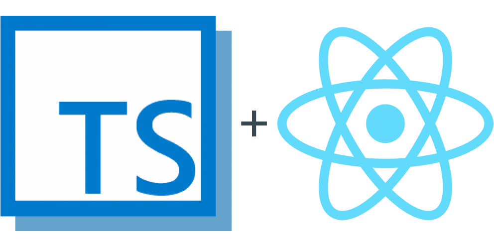

<h1 align="center">
    
    <p>Template para projetos ReactJs com Typescript, ESLint & Prettier</p>
</h1>

<h4 align="center">
	Template para facilitar o desenvolvimento de projetos.
</h4>

<div align="center">

[]()
[]()
[]()
[]()
[](/LICENSE)

</div>

## 📝 Conteúdo
<p align="center">
<a href="#about">Sobre</a>&nbsp;&nbsp;&nbsp;|&nbsp;&nbsp;&nbsp;
<a href="#installing">Instalando</a>&nbsp;&nbsp;&nbsp;|&nbsp;&nbsp;&nbsp;
<a href="#built_using">Tecnologias Utilizadas</a>&nbsp;&nbsp;&nbsp;|&nbsp;&nbsp;&nbsp;
<a href="#authors">Autor</a>
</p>


## 🧐 Sobre <a name = "about"></a>

Esse projeto foi criado com o intuito de facilitar o desenvolvimento de aplicações ReactJs com Typescript e configurado devidamento com Eslint e Prettier.


### ⚒ Instalando <a name = "installing"></a>
```bash
# Clone this repository
$ git clone https://github.com/fcsouza/template-projeto-react-ts

# Go into the repository
$ cd template-projeto-react-ts

# Install dependencies
$ yarn install
$ yarn start

Start Develop
```

## ⛏️ Tecnologias Utilizadas <a name = "built_using"></a>
- [React](https://pt-br.reactjs.org/) - A declarative, efficient, and flexible JavaScript library for building user interfaces
- [Typescript](https://www.typescriptlang.org/) - TypeScript is a typed superset of JavaScript that compiles to plain JavaScript.
- [ESLint](https://eslint.org/) -  Tool for identifying and reporting on patterns found in ECMAScript/JavaScript code
- [Prettier](https://prettier.io/) - Opinionated Code Formatter

## ✍️ Autor <a name = "authors"></a>

- [@fcsouza](https://github.com/fcsouza)

## 🗒 Licença

Esse projeto está sob a licença MIT. Veja o arquivo [LICENSE](LICENSE.md) para mais detalhes.
